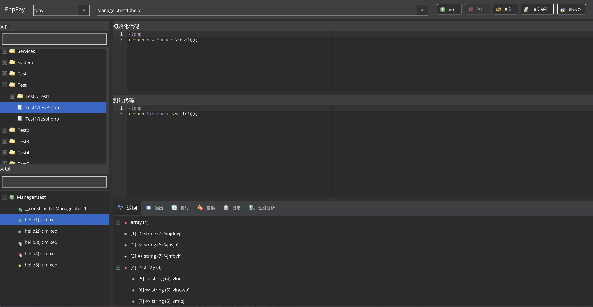

## PHPRay是什么

1. PHP控制台: 给测试环境下的项目开一扇门，让开发人员可以不借助前端环境，仅仅以PHP脚本来检视、操作项目逻辑，并以直观的方式展示脚本运行结果。
2. PHP测试工具: 因为它是一个PHP的控制台，所以可以非常方便的执行我们刚刚写完的方法，并验证是否实现预期的需求。
3. PHP Debug工具：提供了PHP的错误捕捉、日志拦截等功能，同事收集call stack信息，尽可能多的提供方便调试的信息。
4. PHP Profile工具：通过xhprof收集性能信息，查看方法执行过程的路径及耗时情况。

作为PHP测试工具，PHPRay并不提供类似PHPUnit的自动化测试功能，也没有代码覆盖率的要求，更多的是通过执行待测试的方法和在控制台微调方法的参数，而通过人为的理性判断来校验方法的正确性，然而工具会根据方法的存根签名来生成必要的代码，从而降低程序员编写测试脚本的成本。另外，PHPRay提供了执行私有、保护方法的能力，这使得测试这些方法更加方便。

而作为调试工具，与目前较流性的Kint、DebugBar、Whoops等工具相比，PHPRay无需产品引入任何第三方的类库，且能在不改变任何项目代码的前提下，去收集调试信息。

## 安装

1. 环境：
	* PHP 5.3.0或以上
	* runkit 扩展 (或runkit7扩展)
	* xhprof 扩展
2. 在有效的项目测试环境（针对开发环境）下，选择方便http服务部署的路径，执行如下脚本：

	```bash
	git clone https://github.com/dustinfog/phpray.git 
	cd phpray
	composer install
	```
4. 配置HTTP服务器，添加新的站点，将phpray目录作为站点根目录，当然如果在本地机器可以通过PHP -S host:port index.php来启动PHPRay服务。

## 配置

1. 用户配置：
      
	```bash
	cd phpray/conf
	cp passwd.sample.php passwd.php
	```
	
	然后通过修改passwd.php来实现简单的用户管理
2. 项目配置：
   
   ```bash
   cd phpray/conf/projects
   cp sample.php [yoursite].php
   ```
   可以通过多个文件来配置多个项目，这里需要注意的有两个配置项：
   * init: 该回调配置的是能够让项目代码运行起来的最小配置，如include 一个标准compser项目的autoload.php，配置必要环境变量等，如果您的项目无法在PHPRay中运行，那么多数是因为该回调函数配置不当。
   * logInterceptions: 配置在代码执行过程中让PHPRay进行拦截的用于日志记录的方法，这些方法的返回值会在PHPRay的日志一栏里显示出来。

##使用

##安全
1. 切忌安装在生产环境，因为PHPRay理论上可以执行任何合法的PHP脚本，这就相当于把整台机器的控制权暴露在PHPRay之下，所以非常危险。
2. 配置合理的passwd.php，如做严格的IP访问限制。
